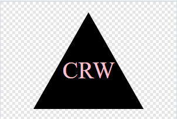

# Simple SVG Generator
   
  
   
Generates a SVG logo based on user inputs!

## Table of Contents

[Description](#Description)  
[Usage](#Usage)  
[Dependencies](#Dependencies)  
[Installing](#Installing)  
[Contributing](#Contributing)  
[Executing](#Executing)  
[Authors](#Authors)  
[License](#License)  

## Description 
  
Allows the user to generate a svg logo with a three letter abbreviation and a simple! It offers three shapes: A circle, triangle, or a sqaure while also allowing the user to set the color of both using the name or hexidecimal value of a color.

## Usage 
If a company or individual needs a quick and simple logo for a business or project, they can generates a one in a few questions!

## Dependencies 
1. NodeJS 
2. VS Code 
3. This repo  

## Installing 
Copy the repo, run npm i in the terminal, run node index.js in the terminal and answer the questions!

## Contributing 
Just open a pull request if you think you can improve this project!

## Tests 
There are 3 tests included in the repo, testing the javaScript to make sure it was returning the correct values based on user inputs.

## Executing program 
Copy repo into VS Code, run npm i in the terminal, run node index.js in the terminal, and answer the questions

## Authors 
Matthew Scott

## License 
This project is licensed under the MIT License. Click on the badge at the top for more information!

## Questions

For any questions you may have, feel free to reach out!  
Here are some ways!  
<a href="https://github.com/MScott-Dev" alt="GitHub">GitHub</a>  
<a href="mailto:MScott0199@gmail.com">Email</a>
